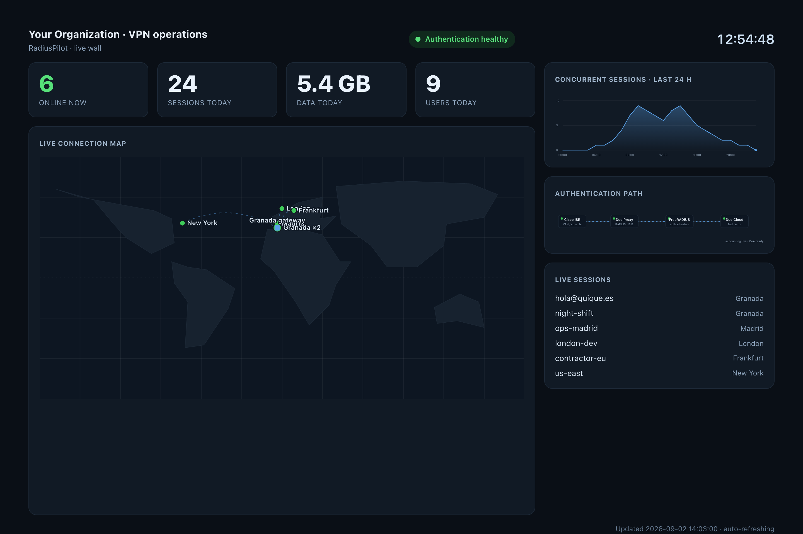
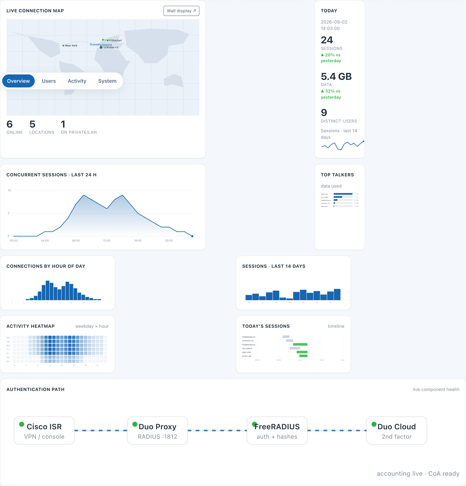
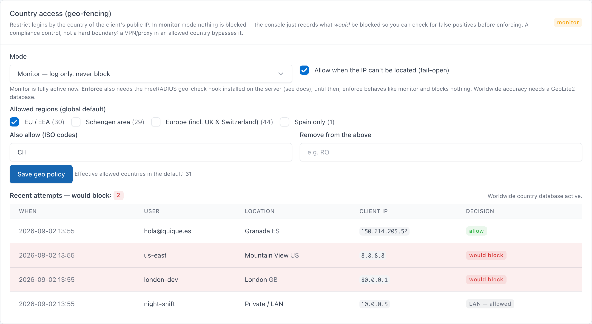
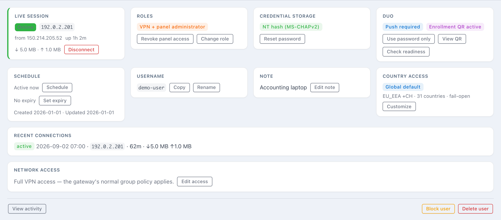

<p align="center">
  
</p>

<p align="center"><strong>Two-factor authentication for your Cisco ISR, the easy way.</strong></p>

Ever wanted to put two-factor authentication in front of your Cisco ISR's
console or VPN access, but never found a setup that just works? This project
makes it easy — and then gives you a live view of who is connected, from where,
and the controls to do something about it.

[](https://github.com/enriquegrx/radius-pilot/actions/workflows/ci.yml)
[](https://github.com/enriquegrx/radius-pilot/actions/workflows/codeql.yml)

RadiusPilot puts Duo two-factor authentication in front of a Cisco ISR's remote
access without the usual pain. People connect with AnyConnect over IKEv2, the
router checks their password against FreeRADIUS, Duo asks for the Push, and a
small web console keeps the accounts and their access under control. The same
chain can also guard **the network devices themselves**: console and SSH logins
to your routers and switches authenticate against the same accounts, with the
same Duo Push. It runs the whole thing with **no database** — just root-owned
JSON state and generated FreeRADIUS `authorize` files.

<p align="center">
  
</p>

## What it does 🧭

**Accounts and 2FA.** List, create, rename, block, unblock and delete VPN
accounts without ever exposing a password. Send one-time invitations so people
choose their own initial password and continue straight into Duo Mobile
enrollment. Switch any account between password-plus-Duo-Push and a temporary,
time-limited password-only exception. Credentials are stored as
MS-CHAPv2-compatible NT hashes, because Cisco IKEv2 cannot validate bcrypt.

**Live operations.** When RADIUS accounting is on, RadiusPilot shows an
**Overview** dashboard and a full-screen **operations wall** (`/wall`): who is
online now, a world map of active sessions geolocated from their public IP,
concurrent-sessions and per-day usage charts, an activity heatmap, a today
timeline, and a live architecture diagram with per-component health. Each online
user can be **disconnected on demand** (RADIUS CoA), and their recent
connections, data usage and concurrent-session warnings are one click away.

<p align="center">
  
</p>

**Country-based access (geo-fencing).** Restrict logins by the country of the
client's public IP — a global default with per-user overrides, region presets
(EU/EEA, Schengen, Spain) plus per-country allow/remove, and a fail-open or
fail-closed choice. It ships a **monitor mode** that records what *would* be
blocked without changing any authentication outcome, so you can check for false
positives before switching on real **enforcement** in FreeRADIUS. It is a
compliance control, not a hard boundary: a VPN or proxy in an allowed country
bypasses it.

<p align="center">
  
</p>

**Device administration.** Give an account the *device admin* role and it can
log in to the **console or SSH of your RADIUS-configured routers and switches**
— password plus Duo Push, landing at privilege 15 — using the same credential it
already has. Device logins ride an isolated FreeRADIUS virtual server and a
dedicated Duo integration, so the VPN path is never touched, and every device
keeps a local break-glass account for the day RADIUS is unreachable.

**Per-user network access.** Give each account either the gateway's normal
full-access profile or a custom allowlist of IPv4 destinations, protocols and
ports, built from reusable, nestable access objects. Everything is validated and
compiled to Cisco reply attributes before it reaches the live service.

<p align="center">
  
</p>

**Safe by construction.** A separate scrypt-hashed console password with its own
Duo Push, a 30-minute idle timeout, CSRF protection and login rate limiting. The
web process runs unprivileged and cannot read the password store; every write
goes through a narrowly scoped root helper, is validated against FreeRADIUS (and
Duo) before the service restarts, and rolls back automatically if anything
fails. A five-minute reconciler enforces account expiries and password-only
exceptions. Administrative changes and VPN authentication results are recorded
without ever storing a password.

## Why it exists 💡

Wiring AnyConnect, a Cisco ISR, FreeRADIUS and the Duo Authentication Proxy
together is well documented but genuinely fiddly, and once it works you still
have to run it. Editing the FreeRADIUS `authorize` file by hand is quick until
account state, Duo exceptions, per-user access and emergency access all need to
stay in sync. This console keeps that workflow simple without turning it into a
general-purpose identity platform. Routine changes stay within three clicks and
every write is validated before it reaches the live authentication service.

## How it works 🧱


The application runs on `radius01` behind Nginx. FastAPI listens only on
loopback; Nginx publishes HTTPS to the approved internal and VPN networks. There
is no WAN NAT, Cloudflare Tunnel or public admin path.

The FastAPI process runs as the unprivileged `radiusui` account. It cannot read
the password store or the generated FreeRADIUS file. Mutations are sent as JSON
over stdin to a narrowly scoped root helper through `sudo`, so passwords never
appear in process lists. The helper is the only writer of the root-owned state
(`/var/lib/radius-user-admin/users.json`), the generated FreeRADIUS `authorize`
file, the console administrator verifier, the append-only audit log, and the
dated backup taken before every change.

### Where the live data comes from 🛰️

RadiusPilot never asks the client for its location — it reads what the Cisco ISR
already reports, all of it flowing through the same authentication chain:

- The **ISR** includes the client's real public IP as `Calling-Station-Id` in
  every RADIUS Access-Request and accounting packet, and the assigned tunnel IP
  as `Framed-IP-Address`.
- The **Duo Authentication Proxy** sits in front: it logs each authentication —
  including that client IP — to its structured `authevents.log`, and forwards
  the primary check to FreeRADIUS.
- With `aaa accounting` enabled, the ISR streams Start / Interim / Stop records
  to FreeRADIUS, written to a detail file with the client IP, tunnel IP, session
  time and byte counters.

From those three sources RadiusPilot builds everything else, with an **offline**
IP-to-location database (GeoLite2 or the free DB-IP Country Lite, in MaxMind
`.mmdb` format) — no third-party geolocation calls:

- **Online now, the live map and usage** come from RADIUS accounting.
- **Geo-fencing monitor** reads the client IP from the Duo proxy's auth log and
  records what the country policy would decide.
- **Geo-fencing enforce** is a small FreeRADIUS hook that reads
  `Calling-Station-Id` on the live Access-Request and rejects a disallowed
  country before the Duo Push.

The country hook is deliberately fail-safe: it rejects only in enforce mode, and
any error, timeout, private/unresolved IP under fail-open, or non-enforce mode
allows the login. Switching a policy between off, monitor and enforce takes
effect on the next authentication with no FreeRADIUS reload.

The interface uses the open-source [Tabler](https://tabler.io/) design system,
vendored locally under its MIT license. Charts, the map and the wall are plain
inline SVG rendered in the browser — no charting library and no CDN.

## Open the console 🌐

From a device on an approved LAN or connected through the organization VPN, open
`https://radius.your-domain.com`. Nginx and nftables both enforce the
source-network allowlist.

<p align="center">
  
</p>

Sign in with the separate console administrator account and approve the Duo
Push. The username entered for a VPN account must match the username enrolled in
Duo when Duo Push is required; email-style usernames such as
`user@your-domain.com` are supported.

## Country-based access (geo-fencing) 🌍

Geo-fencing has a global default policy and optional per-user overrides. A policy
is a set of allowed countries built from region presets plus per-country
adjustments, with a fail-open or fail-closed choice for IPs that cannot be
located. An empty policy is a safe no-op — it allows everyone rather than
blocking everyone.

It rolls out in two stages so it can never lock people out by surprise:

1. **Monitor** (pure console, zero risk). RadiusPilot evaluates what the policy
   *would* decide for recent authentications and live sessions, entirely from
   data it already has, and shows a would-block feed. Nothing about
   authentication changes. Run it until the feed shows no false positives.
2. **Enforce** (a FreeRADIUS hook). Install
   `deploy/radius-pilot-geo-check` and wire `deploy/freeradius-geo-check.conf`
   into the primary-auth site (a deliberate, documented step). The hook reads the
   per-user allow-lists the console compiles on every change and rejects a
   disallowed country before the Duo Push. Flip the console mode to enforce when
   you are ready — it takes effect immediately.

Worldwide country resolution needs an offline database. Point
`RADIUS_ADMIN_GEOIP_MMDB` at a GeoLite2 or DB-IP Country `.mmdb`, or drop one in
`/var/lib/GeoIP/` where both the console and the hook find it automatically
(install `python3-maxminddb`). Without a database, only well-known ranges
resolve and everything else is treated as unlocated, allowed under fail-open.

## Duo on the network CLI (device administration) 🔐

One click in the console gives an account the **device admin** role. RadiusPilot
writes it — the same NT hash the VPN uses, plus `Service-Type` and
`Cisco-AVPair = "shell:priv-lvl=15"` — to an isolated authorize file served by a
dedicated FreeRADIUS virtual server, so device logins never touch the VPN path.
Console and SSH logins to the devices then flow:

```
SSH / console → device → Duo Auth Proxy :1815 → FreeRADIUS device-admin :1814
             → Duo Push 📱 → privilege 15
```

**Server side.** Install `deploy/freeradius-device-admin.conf` (the virtual
server that answers PAP against the generated file on 1814) and add a second Duo
Authentication Proxy integration that fronts it with the Push:

```ini
[radius_client1]
host=192.0.2.112                 ; the FreeRADIUS device-admin listener
port=1814
secret=<proxy-to-freeradius secret>
pass_through_attr_names=Cisco-AVPair

[radius_server_auto1]
ikey=...                        ; same Duo application as the VPN, or its own
skey=...
api_host=api-XXXXXXXX.duosecurity.com
radius_ip_1=192.0.2.1           ; one entry per device allowed to authenticate
radius_secret_1=<device-to-proxy secret>
client=radius_client1
port=1815
failmode=safe                   ; a Duo-cloud outage must not lock admins out
```

**On each IOS/IOS-XE device**, use **named** method lists so the `default` lists
and the VPN AAA stay untouched, keep `local` as the break-glass, and give the
Push time to be approved:

```
radius server RADIUSPILOT-ADMIN
 address ipv4 192.0.2.112 auth-port 1815 acct-port 0
 key <device-to-proxy secret>
 timeout 60
 retransmit 1
aaa group server radius RADIUSPILOT-ADMIN-RADIUS
 server name RADIUSPILOT-ADMIN
aaa authentication login RADIUSPILOT-ADMIN group RADIUSPILOT-ADMIN-RADIUS local
aaa authorization exec RADIUSPILOT-ADMIN group RADIUSPILOT-ADMIN-RADIUS local if-authenticated
line con 0
 login authentication RADIUSPILOT-ADMIN
 authorization exec RADIUSPILOT-ADMIN
line vty 0 15
 login authentication RADIUSPILOT-ADMIN
 authorization exec RADIUSPILOT-ADMIN
```

Apply it under a scheduled `reload in 15`, verify from a **new** session — the
device's `test aaa group RADIUSPILOT-ADMIN-RADIUS <user> <password> new-code` is
the fastest end-to-end check — and only then `reload cancel` and `write memory`.
Worth knowing:

- The device sends the login as PAP; FreeRADIUS verifies it against the same NT
  hash MS-CHAPv2 uses for the VPN, so **one credential serves both**.
- `failmode=safe` covers a Duo-cloud outage; the lines' `local` covers a full
  RADIUS outage. A **reject never falls back** — only unreachability does.
- `timeout 60` on the device's `radius server` is required: the default ~5 s
  expires before anyone can approve the Push.
- Open the firewall for 1815/udp from each device (see `deploy/nftables.conf`),
  and keep [docs/ports-and-services.md](docs/ports-and-services.md) as the map
  of every port and shared secret in the chain.
- After changing who holds the device-admin role, restart FreeRADIUS — the
  `files` module caches the generated file.
- RADIUS provides login and privilege level. Per-command authorization and
  command accounting are TACACS+ territory, which FreeRADIUS does not speak.

## Configuring the Cisco ISR and FreeRADIUS 📡

[docs/cisco-isr-freeradius.md](docs/cisco-isr-freeradius.md) contains the
minimal working configuration for everything around RadiusPilot: the ISR's AAA
and RADIUS plumbing, a complete AnyConnect-over-IKEv2 (FlexVPN) profile, the
device-administration rollout (console/SSH logins with Duo across your routers
and switches, including the two-stage no-Duo-first procedure), the Duo
Authentication Proxy file, the FreeRADIUS pieces, the RADIUS accounting that
powers the live map, and the CoA (dynamic-author) that powers the Disconnect
button. It also
explains the settings people most often get wrong: the long RADIUS timeout the
Push needs, `aaa authorization user anyconnect-eap cached` (required for custom
access policies to be enforced), periodic interim accounting (required so a
long-lived session does not silently age out of "online now"), and seeding the
AnyConnect XML profile for the first connection.

## Development 🧰

```bash
python3 -m venv .venv
.venv/bin/pip install -e '.[dev]'
.venv/bin/pytest
.venv/bin/pytest --cov=radius_user_admin --cov-fail-under=65
.venv/bin/ruff check .
```

For a local UI run that does not touch FreeRADIUS, provide a fake helper — it
serves demonstration users, sessions, dashboard and geo data so the whole
console, map and wall are explorable offline:

```bash
RADIUS_ADMIN_HELPER=tests/fake_helper.py \
RADIUS_ADMIN_SESSION_SECRET=development-only \
RADIUS_ADMIN_SECURE_COOKIE=0 \
.venv/bin/uvicorn radius_user_admin.app:app --reload
```

## Production notes 🚀

Deployment is intentionally Debian-native: packaged Python modules, a hardened
systemd unit, a dedicated service user, Nginx with a Let's Encrypt certificate,
and a single sudoers entry. Do not bind Uvicorn to a LAN address or add public
NAT.

From a checkout on the target host, `sudo deploy/install.sh` installs the
application, the `radiusui` service account, the root helper and its sudoers
rule, the geo-check hook, the systemd unit and reconciliation timer, and the
root-only state directory. It is idempotent, never overwrites an existing
environment file or state, and leaves the site-specific pieces — Nginx, TLS,
nftables, FreeRADIUS, Duo, and the router — to be applied by hand (their example
files sit in `deploy/`, and the Cisco/FreeRADIUS steps are in
[docs/cisco-isr-freeradius.md](docs/cisco-isr-freeradius.md)). It then prints the
bootstrap and enable commands.

Once installed, `RELEASE_TARGET=user@host [RELEASE_JUMP=user@jump]
deploy/release.sh` ships a new version of the running console: it gates on the
local tests and linter, uploads the source, backs up what is live, swaps it in,
records the version, compiles it, validates FreeRADIUS, runs a reconcile,
restarts only the web service and health-checks it — rolling the source back
automatically if any step fails. Authentication uses your ssh configuration; the
target account needs sudo.

Copy `deploy/environment.example` to `/etc/radius-user-admin/environment`, set a
random session secret and the real HTTPS URL, then keep the file readable only
by root and the service account. SMTP is optional. Without it, a newly created
invitation is displayed once for delivery through a trusted channel. Invitation
pages remain behind the same LAN/VPN allowlist, and Nginx access logging is
disabled so bearer tokens do not enter request logs.

Set `RADIUS_ADMIN_AUTHORIZE_PATH` when the managed FreeRADIUS files module uses
a site-specific directory. The helper deliberately has no directory discovery:
an explicit path prevents it from editing the wrong `authorize` file.

### Per-user VPN access policies

Every account has one of two network access modes:

- **Full access** keeps the gateway's existing VPN group policy. This is the
  default for new accounts and for accounts migrated from an older RadiusPilot
  state file.
- **Custom access** permits only the destinations and services selected in the
  panel. A destination may be a single IPv4 host or a CIDR network. Protocols
  are limited to IP, ICMP, TCP, and UDP; TCP and UDP require one or more
  individual ports or ordered ranges such as `443,8000-8010`.

Custom input is canonicalised and checked against
`RADIUS_ADMIN_POLICY_DESTINATIONS`. Loopback, link-local, multicast,
unspecified, IPv6, `/0`, out-of-scope destinations, malformed ports, and
unknown fields are rejected. Structural limits allow up to 24 rules and 63
permit entries, while a stricter RADIUS reply budget caps the result at 48
Cisco attributes and 3,000 encoded bytes. A maximal combination may therefore
be rejected before those structural ceilings. Duplicate rules are removed.
The generated downloadable ACL always ends with an explicit `deny ip any any`
entry.

RadiusPilot returns two kinds of `Cisco-AVPair` for a custom account:

- `ipsec:route-set=prefix ...` gives the VPN client a useful route to each
  selected destination.
- `ip:inacl#...` carries the ordered permit entries and final deny entry that
  enforce the policy on the VPN session.

The distinction matters: **a pushed route is not a security boundary**. A route
only tells the client where to send traffic. Enforcement comes from the ACL
installed on the session, and the target IOS XE release must be tested to prove
both an allowed connection and a denied connection.

Custom access is deliberately protected by two independent readiness checks.
First, narrow the destination scope and leave the feature disabled:

```dotenv
RADIUS_ADMIN_POLICY_DESTINATIONS=192.0.2.0/24,198.51.100.0/24
RADIUS_ADMIN_CUSTOM_DACL_ENABLED=0
RADIUS_ADMIN_LOCAL_FALLBACK_USERS=router-break-glass
```

List every router-local fallback username in
`RADIUS_ADMIN_LOCAL_FALLBACK_USERS`. RadiusPilot refuses to assign Custom
access to those names: if RADIUS became unreachable, the gateway could
authenticate the matching local account without any downloaded attributes.
Keep restricted VPN identities separate from break-glass router accounts.

Then allow the Duo Authentication Proxy to preserve only the required reply
attribute. Add this setting to its existing `[radius_client]` section; do not
place it in the RadiusPilot-managed exemption block:

```ini
[radius_client]
pass_through_attr_names=Cisco-AVPair
```

If that section already forwards named attributes, keep the existing names and
append `Cisco-AVPair` to the comma-separated value. Broad
`pass_through_all=true` forwarding also satisfies the technical check, but a
narrow named allowlist is easier to review.

The five-minute reconciler also treats this dependency as a fail-closed
condition. If attribute forwarding is removed while custom accounts exist,
their active FreeRADIUS entries are withheld until forwarding is healthy
again. Their saved policies are retained, so access can be restored without
rebuilding the rules.

#### Safe rollout checklist 🚦

1. Back up the RadiusPilot state, generated `authorize` file, and Duo
   Authentication Proxy configuration with a dated identifier.
2. Deploy the application while
   `RADIUS_ADMIN_CUSTOM_DACL_ENABLED=0`. Bootstrap or migrate the state, run the
   test suite, validate the full FreeRADIUS configuration, and confirm the web
   service still lists existing accounts as full access.
3. Add `Cisco-AVPair` forwarding to a temporary Duo configuration, run Duo's
   connectivity/configuration check, install it with its original ownership and
   permissions, and restart the proxy only after validation succeeds.
4. Set `RADIUS_ADMIN_CUSTOM_DACL_ENABLED=1`, restart RadiusPilot, and create a
   temporary password-only canary account with one tightly scoped allow rule.
5. Start a new VPN session with the canary. Confirm that its intended host and
   port work, and that a different port and destination are denied. Inspect the
   IOS XE session if the platform exposes the downloaded ACL.
6. Disconnect and remove the canary. If either deny test fails, set the feature
   gate back to `0`, restart RadiusPilot, restore the previous Duo configuration,
   and do not assign custom policies on that platform.

Policy changes apply to newly authenticated sessions. An already connected user
must disconnect and reconnect before a new ACL or route set takes effect. The
same reconnect rule applies when changing an account back to full access.

#### Reusable access objects

A saved access object is a named list of rules and, optionally, references to
other objects; a policy may mix inline rules with object references. Editing an
object propagates on the next `authorize` regeneration to every policy that
references it, and the edit is first revalidated against every referencing
user, invitation, and object — including the RADIUS reply budget — so a change
that would break any of them is rejected whole with the affected name. Deleting
an object is refused while anything still references it. Reference loops and
nesting deeper than eight levels are rejected, an unknown reference fails
closed, and the generated `authorize` file always records the resolved concrete
rules so disaster-recovery bootstrap never depends on the object store.

### Password migration

New accounts and password resets use an MS-CHAPv2-compatible NT hash
automatically. Upgrade an existing installation gradually: migrate one test
account, complete a real VPN login, then migrate the remainder. Every step
creates a normal RadiusPilot backup and validates FreeRADIUS before restarting
it.

```bash
printf '%s\n' '{"username":"pilot-user","_actor":"migration"}' \
  | sudo /usr/local/sbin/radius-user-admin-helper migrate-passwords

printf '%s\n' '{"_actor":"migration"}' \
  | sudo /usr/local/sbin/radius-user-admin-helper migrate-passwords
```

Restoring the automatically created backup returns both the user state and the
generated `authorize` file to their previous format.

`radius-user-admin-reconcile.timer` runs every five minutes. It blocks expired
accounts, restores Duo enforcement when a temporary password-only exception
expires, and recompiles the geo-fencing allow-lists. No service restart occurs
when there is nothing to change.

GitHub Actions runs Ruff, the test suite, dependency auditing and CodeQL on the
public repository. Dependabot keeps Python and workflow dependencies visible
for review; production updates should still be pinned and tested before deploy.

### Release and deployment flow

A push to GitHub **does not deploy RadiusPilot**. The repository workflows are
validation-only and hold no production SSH credentials. A production release is
an explicit operator action after CI succeeds: take a timestamped backup, copy
the reviewed files over an approved administrative path, compile the Python
modules, run the privileged bootstrap/reconciliation helper, validate the full
FreeRADIUS configuration, restart only the web service, and check `/healthz`.
If any step fails, restore the saved application files, user state, and managed
`authorize` file before restarting the affected services. `deploy/release.sh`
automates exactly this sequence.

An internal LAN runner may automate that sequence later, but it should consume
an immutable reviewed revision and require an approval gate. Do not configure a
public GitHub-hosted runner to reach the authentication server directly, and do
not deploy every push to `main` automatically.
