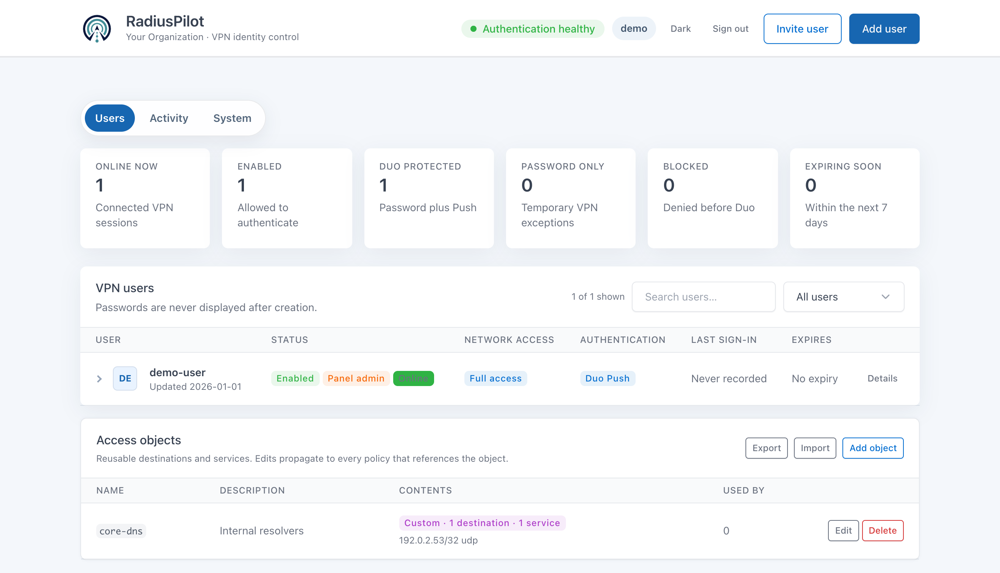
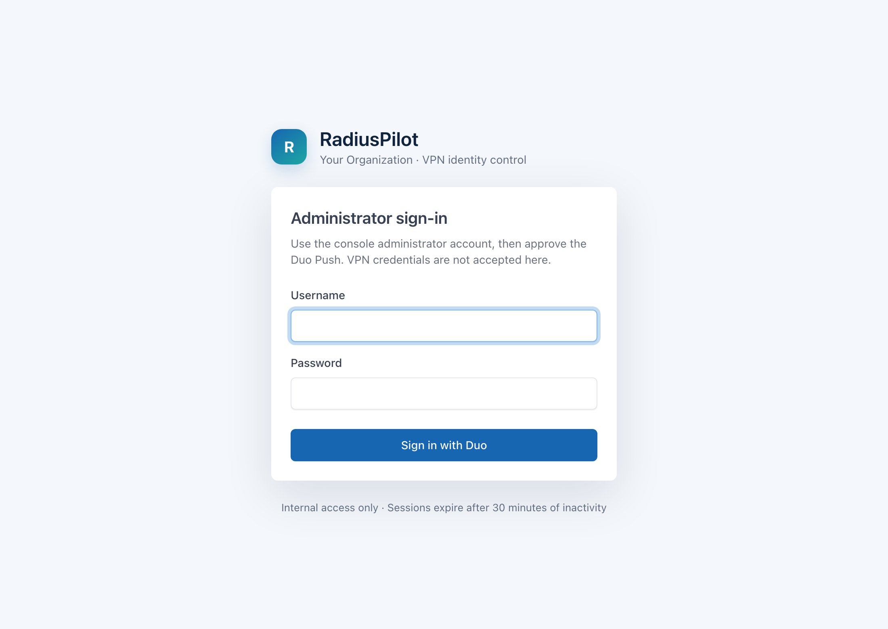

<p align="center">
  
</p>

<p align="center"><strong>Two-factor authentication for your Cisco ISR, the easy way.</strong></p>

Ever wanted to put two-factor authentication in front of your Cisco ISR's
console or VPN access, but never found a setup that just works? This project
makes it easy.

[](https://github.com/enriquegrx/radius-pilot/actions/workflows/ci.yml)
[](https://github.com/enriquegrx/radius-pilot/actions/workflows/codeql.yml)

RadiusPilot puts Duo two-factor authentication in front of a Cisco ISR's remote
access without the usual pain. People connect with AnyConnect over IKEv2, the
router checks their password against FreeRADIUS, Duo asks for the Push, and the
same FreeRADIUS-plus-Duo chain can front the router's own login as well. A
small web console keeps the accounts under control: see who has access, add an
account, enrol it in Duo, reset a password, block it, or remove it.



The application runs on `radius01` behind Nginx. FastAPI listens only on
loopback; Nginx publishes HTTPS to the approved internal and VPN networks. There
is no WAN NAT, Cloudflare Tunnel, or public admin path.

## Why it exists 💡

Wiring AnyConnect, a Cisco ISR, FreeRADIUS and the Duo Authentication Proxy
together is well documented but genuinely fiddly, and once it works you still
have to run it. Editing the FreeRADIUS `authorize` file by hand is quick until
account state, Duo exceptions and emergency access all need to stay in sync.
This console keeps that workflow simple without turning it into a
general-purpose identity platform. Routine changes stay within three clicks and
every write is validated before it reaches the live authentication service.

## What it does 🧭

- Lists enabled and blocked users without exposing passwords.
- Creates, renames, blocks, unblocks, and deletes accounts.
- Creates one-time invitations so users can choose their own initial password
  and continue directly into Duo Mobile enrollment.
- Stores new and reset VPN credentials as MS-CHAPv2-compatible NT hashes.
  Existing clear-text entries can be migrated one account at a time with
  backup and rollback. Cisco IKEv2 cannot validate bcrypt credentials.
- Switches each enabled account between password plus Duo Push and password only.
- Gives each VPN account either the normal full-access profile or a custom
  allowlist of IPv4 destinations, protocols, and ports.
- Stores reusable, nestable access objects so common destinations and services
  are defined once and referenced from many policies; edits propagate and are
  revalidated against every referencing policy before they are accepted.
- Protects the console with a separate scrypt-hashed administrator password,
  Duo Push, a 30-minute idle timeout, CSRF protection, and login rate limiting.
- Assigns panel access as an explicit per-user role. A panel administrator keeps
  a separate console password, must be Duo-ready, and may not reuse the VPN
  password. The final panel administrator cannot be revoked or deleted.
- Records administrative changes and recent VPN authentication results without
  storing passwords in the audit trail.
- Supports account expirations and time-limited password-only exceptions; a
  systemd timer enforces both automatically every five minutes.
- Checks Duo enrollment and Push capability before enabling Duo for an account.
- Creates seven-day Duo Mobile activations through the Auth API and presents the
  QR code or mobile activation link only to a signed-in panel administrator.
- Shows service, certificate, disk, and backup health, and exports redacted
  diagnostics and audit CSV files.
- Optionally shows who is connected right now, with assigned IP and session
  duration, from RADIUS accounting.
- Optionally emails the administrator when the service degrades or recovers and
  before accounts expire.
- Lists configuration backups and restores them through the same validation and
  rollback path used for ordinary changes.
- Resets a password without ever showing the previous one.
- Refuses to block or delete the final enabled account.
- Validates the full FreeRADIUS configuration before restarting the service.
- Validates both FreeRADIUS and Duo Authentication Proxy before restarting them.
- Restores all previous files automatically if validation or restart fails.
- Keeps a root-owned state file and generates the existing `authorize` file.

The username entered here must match the username enrolled in Duo when Duo Push
is required. Email-style usernames such as `user@your-domain.com` are supported.
Password-only mode uses Duo Authentication Proxy's
`exempt_username_N` setting for this VPN integration; FreeRADIUS still checks the
primary password. It does not place the user in global Duo bypass. Blocking a
user removes it from the generated FreeRADIUS file, so neither the primary
password nor Duo Push is reached.

## Open the console 🌐

From a device on an approved LAN or connected through the Example Organization VPN, open
<https://radius.your-domain.com>. Nginx and nftables both enforce the source-network
allowlist.

<p align="center">
  
</p>

Sign in with the separate console administrator account and approve the Duo Push.

## Architecture 🧱


The FastAPI process runs as the unprivileged `radiusui` account. It cannot read
the password store or the generated FreeRADIUS file. Mutations are sent as JSON
over stdin to a narrowly scoped root helper through `sudo`; passwords therefore
do not appear in process lists.

The helper maintains:

- `/var/lib/radius-user-admin/users.json` — root-only source of truth.
- `/etc/freeradius/3.0/mods-config/files/vpn-users/authorize` — generated
  active users consumed by FreeRADIUS.
- `/opt/duoauthproxy/conf/authproxy.cfg` — retains its hand-written settings and
  receives only a marked, generated username-exemption block.
- `/var/lib/radius-user-admin/admins.json` — root-only scrypt verifier for the
  console administrator; it does not contain the clear-text password.
- `/var/lib/radius-user-admin/audit.jsonl` — append-only administrative audit
  events with actor and source address, never credentials.
- `/var/lib/radius-user-admin/duo-enrollments.json` — root-only temporary Duo
  activation links and expiry times.
- `/var/lib/radius-user-admin/invitations.json` — root-only invitation metadata;
  only SHA-256 token digests are retained, never the usable links.
- `/etc/radius-user-admin/duo-enroll-api.json` — root-only credentials for the
  dedicated Auth API enrollment integration; this file must never enter Git.
- `/var/backups/radius-user-admin/` — dated snapshots before every mutation.

For a custom access policy, the helper compiles the validated form fields into
Cisco `Cisco-AVPair` reply attributes in the generated FreeRADIUS file. The
browser never accepts raw ACL lines or arbitrary RADIUS attributes. Full-access
accounts receive no policy attributes and continue to use the VPN gateway's
normal group policy.

Authentication history is read from Duo Authentication Proxy's structured
`authevents.log`. Only the timestamp, username, source address, stage, and result
are returned to the web process.

The interface uses the open-source [Tabler](https://tabler.io/) design system,
vendored locally under its MIT license.

## Configuring the Cisco ISR and FreeRADIUS 📡

[docs/cisco-isr-freeradius.md](docs/cisco-isr-freeradius.md) contains the
minimal working configuration for everything around RadiusPilot: the ISR's AAA
and RADIUS plumbing, a complete AnyConnect-over-IKEv2 (FlexVPN) profile,
optional Duo-protected SSH logins to the router itself, the Duo Authentication
Proxy file, and the FreeRADIUS pieces. It also explains the three settings
people most often get wrong: the long RADIUS timeout the Push needs,
`aaa authorization user anyconnect-eap cached` (required for custom access
policies to be enforced), and seeding the AnyConnect XML profile for the very
first connection.

## Development 🧰

```bash
python3 -m venv .venv
.venv/bin/pip install -e '.[dev]'
.venv/bin/pytest
.venv/bin/pytest --cov=radius_user_admin --cov-fail-under=65
.venv/bin/ruff check .
```

For a local UI run that does not touch FreeRADIUS, provide a fake helper:

```bash
RADIUS_ADMIN_HELPER=tests/fake_helper.py \
RADIUS_ADMIN_SESSION_SECRET=development-only \
.venv/bin/uvicorn radius_user_admin.app:app --reload
```

## Production notes 🚀

Deployment is intentionally Debian-native: packaged Python modules, a hardened
systemd unit, a dedicated service user, Nginx with a Let's Encrypt certificate,
and a single sudoers entry. Do not bind Uvicorn to a LAN address or add public
NAT. Certificate issuance and renewal use DNS-01 on `pki01`; the deploy hook
copies the renewed files to `radius01`, tests Nginx, and reloads it.

From a checkout on the target host, `sudo deploy/install.sh` installs the
application, the `radiusui` service account, the root helper and its sudoers
rule, the systemd unit and reconciliation timer, and the root-only state
directory. It is idempotent, never overwrites an existing environment file or
state, and leaves the site-specific pieces — Nginx, TLS, nftables, FreeRADIUS,
Duo, and the router — to be applied by hand (their example files sit in
`deploy/`, and the Cisco/FreeRADIUS steps are in
[docs/cisco-isr-freeradius.md](docs/cisco-isr-freeradius.md)). It then prints
the bootstrap and enable commands.

Once installed, `RELEASE_TARGET=user@host [RELEASE_JUMP=user@jump]
deploy/release.sh` ships a new version of the running console: it gates on the
local tests and linter, uploads the source, backs up what is live, swaps it in,
records the version, compiles it, validates FreeRADIUS, runs a reconcile,
restarts only the web service and health-checks it — rolling the source back
automatically if any step fails. Authentication uses your ssh configuration; the
target account needs sudo.

Copy `deploy/environment.example` to `/etc/radius-user-admin/environment`, set a
random session secret and the real HTTPS URL, then keep the file readable only
by root and the service account. SMTP is optional. Without it, a newly created
invitation is displayed once for delivery through a trusted channel. Invitation
pages remain behind the same LAN/VPN allowlist, and Nginx access logging is
disabled so bearer tokens do not enter request logs.

Set `RADIUS_ADMIN_AUTHORIZE_PATH` when the managed FreeRADIUS files module uses
a site-specific directory. The helper deliberately has no directory discovery:
an explicit path prevents it from editing the wrong `authorize` file.

### Per-user VPN access policies

Every account has one of two network access modes:

- **Full access** keeps the gateway's existing VPN group policy. This is the
  default for new accounts and for accounts migrated from an older RadiusPilot
  state file.
- **Custom access** permits only the destinations and services selected in the
  panel. A destination may be a single IPv4 host or a CIDR network. Protocols
  are limited to IP, ICMP, TCP, and UDP; TCP and UDP require one or more
  individual ports or ordered ranges such as `443,8000-8010`.

Custom input is canonicalised and checked against
`RADIUS_ADMIN_POLICY_DESTINATIONS`. Loopback, link-local, multicast,
unspecified, IPv6, `/0`, out-of-scope destinations, malformed ports, and
unknown fields are rejected. Structural limits allow up to 24 rules and 63
permit entries, while a stricter RADIUS reply budget caps the result at 48
Cisco attributes and 3,000 encoded bytes. A maximal combination may therefore
be rejected before those structural ceilings. Duplicate rules are removed.
The generated downloadable ACL always ends with an explicit `deny ip any any`
entry.

RadiusPilot returns two kinds of `Cisco-AVPair` for a custom account:

- `ipsec:route-set=prefix ...` gives the VPN client a useful route to each
  selected destination.
- `ip:inacl#...` carries the ordered permit entries and final deny entry that
  enforce the policy on the VPN session.

The distinction matters: **a pushed route is not a security boundary**. A route
only tells the client where to send traffic. Enforcement comes from the ACL
installed on the session, and the target IOS XE release must be tested to prove
both an allowed connection and a denied connection.

Custom access is deliberately protected by two independent readiness checks.
First, narrow the destination scope and leave the feature disabled:

```dotenv
RADIUS_ADMIN_POLICY_DESTINATIONS=192.0.2.0/24,198.51.100.0/24
RADIUS_ADMIN_CUSTOM_DACL_ENABLED=0
RADIUS_ADMIN_LOCAL_FALLBACK_USERS=router-break-glass
```

List every router-local fallback username in
`RADIUS_ADMIN_LOCAL_FALLBACK_USERS`. RadiusPilot refuses to assign Custom
access to those names: if RADIUS became unreachable, the gateway could
authenticate the matching local account without any downloaded attributes.
Keep restricted VPN identities separate from break-glass router accounts.

Then allow the Duo Authentication Proxy to preserve only the required reply
attribute. Add this setting to its existing `[radius_client]` section; do not
place it in the RadiusPilot-managed exemption block:

```ini
[radius_client]
pass_through_attr_names=Cisco-AVPair
```

If that section already forwards named attributes, keep the existing names and
append `Cisco-AVPair` to the comma-separated value. Broad
`pass_through_all=true` forwarding also satisfies the technical check, but a
narrow named allowlist is easier to review.

The five-minute reconciler also treats this dependency as a fail-closed
condition. If attribute forwarding is removed while custom accounts exist,
their active FreeRADIUS entries are withheld until forwarding is healthy
again. Their saved policies are retained, so access can be restored without
rebuilding the rules.

#### Safe rollout checklist 🚦

1. Back up the RadiusPilot state, generated `authorize` file, and Duo
   Authentication Proxy configuration with a dated identifier.
2. Deploy the application while
   `RADIUS_ADMIN_CUSTOM_DACL_ENABLED=0`. Bootstrap or migrate the state, run the
   test suite, validate the full FreeRADIUS configuration, and confirm the web
   service still lists existing accounts as full access.
3. Add `Cisco-AVPair` forwarding to a temporary Duo configuration, run Duo's
   connectivity/configuration check, install it with its original ownership and
   permissions, and restart the proxy only after validation succeeds.
4. Set `RADIUS_ADMIN_CUSTOM_DACL_ENABLED=1`, restart RadiusPilot, and create a
   temporary password-only canary account with one tightly scoped allow rule.
5. Start a new VPN session with the canary. Confirm that its intended host and
   port work, and that a different port and destination are denied. Inspect the
   IOS XE session if the platform exposes the downloaded ACL.
6. Disconnect and remove the canary. If either deny test fails, set the feature
   gate back to `0`, restart RadiusPilot, restore the previous Duo configuration,
   and do not assign custom policies on that platform.

Policy changes apply to newly authenticated sessions. An already connected user
must disconnect and reconnect before a new ACL or route set takes effect. The
same reconnect rule applies when changing an account back to full access.

#### Reusable access objects

A saved access object is a named list of rules and, optionally, references to
other objects; a policy may mix inline rules with object references. Editing an
object propagates on the next `authorize` regeneration to every policy that
references it, and the edit is first revalidated against every referencing
user, invitation, and object — including the RADIUS reply budget — so a change
that would break any of them is rejected whole with the affected name. Deleting
an object is refused while anything still references it. Reference loops and
nesting deeper than eight levels are rejected, an unknown reference fails
closed, and the generated `authorize` file always records the resolved concrete
rules so disaster-recovery bootstrap never depends on the object store.

### Password migration

New accounts and password resets use an MS-CHAPv2-compatible NT hash
automatically. Upgrade an existing installation gradually: migrate one test
account, complete a real VPN login, then migrate the remainder. Every step
creates a normal RadiusPilot backup and validates FreeRADIUS before restarting
it.

```bash
printf '%s\n' '{"username":"pilot-user","_actor":"migration"}' \
  | sudo /usr/local/sbin/radius-user-admin-helper migrate-passwords

printf '%s\n' '{"_actor":"migration"}' \
  | sudo /usr/local/sbin/radius-user-admin-helper migrate-passwords
```

Restoring the automatically created backup returns both the user state and the
generated `authorize` file to their previous format.

`radius-user-admin-reconcile.timer` runs every five minutes. It blocks expired
accounts and restores Duo enforcement when a temporary password-only exception
expires. No service restart occurs when there is nothing to change.

GitHub Actions runs Ruff, the test suite, dependency auditing and CodeQL on the
public repository. Dependabot keeps Python and workflow dependencies visible
for review; production updates should still be pinned and tested before deploy.

### Release and deployment flow

A push to GitHub **does not deploy RadiusPilot**. The repository workflows are
validation-only and hold no production SSH credentials. A production release is
an explicit operator action after CI succeeds: take a timestamped backup, copy
the reviewed files over an approved administrative path, compile the Python
modules, run the privileged bootstrap/reconciliation helper, validate the full
FreeRADIUS configuration, restart only the web service, and check `/healthz`.
If any step fails, restore the saved application files, user state, and managed
`authorize` file before restarting the affected services.

An internal LAN runner may automate that sequence later, but it should consume
an immutable reviewed revision and require an approval gate. Do not configure a
public GitHub-hosted runner to reach the authentication server directly, and do
not deploy every push to `main` automatically.
