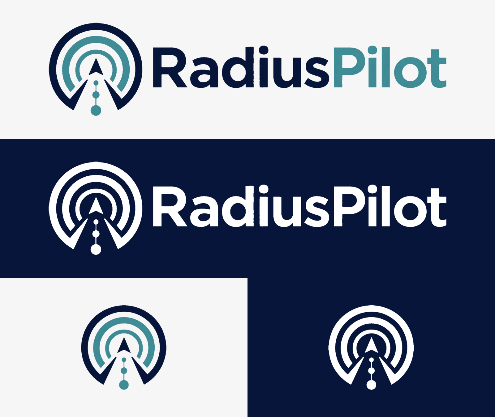

# RadiusPilot brand assets 🧭

This directory contains the approved RadiusPilot logo and the exports normally
needed by the web console, GitHub, Windows and macOS. The selected mark combines
a radar signal, a navigation pointer and a short antenna: infrastructure access
with a clear sense of direction.



## Which file should I use?

| File | Size | Best use |
| --- | ---: | --- |
| `radiuspilot-lockup-horizontal.png` | 2446 × 624 | Primary logo on a light background |
| `radiuspilot-lockup-stacked.png` | 1580 × 1000 | Narrow or portrait layouts |
| `radiuspilot-wordmark.png` | 1822 × 322 | Wordmark when the symbol is already present |
| `radiuspilot-mark-1024.png` | 1024 × 1024 | Symbol-only master with transparency |
| `radiuspilot-mark-{512,256,128,64}.png` | Square | Ready-made symbol exports |
| `radiuspilot-lockup-mono-navy.png` | 2446 × 624 | One-colour use on pale backgrounds |
| `radiuspilot-lockup-mono-white.png` | 2446 × 624 | One-colour use on dark backgrounds |
| `radiuspilot-mark-mono-{navy,white}.png` | 1024 × 1024 | One-colour symbol |
| `favicon.svg` | Vector | Small, optically simplified browser icon |
| `favicon-{16,32,48}.png` | Square | Browser fallbacks and quick QA |
| `radiuspilot.ico` | 16–256 px | Multi-resolution Windows/browser icon |
| `apple-touch-icon.png` | 180 × 180 | Apple home-screen icon |
| `radiuspilot-avatar-512.png` | 512 × 512 | Repository or social profile avatar |
| `github-social-preview.png` | 1280 × 640 | GitHub repository social preview |
| `radiuspilot-approved-source.png` | 2776 × 1040 | Approved source artwork; keep unchanged |

The PNG masters are raster files. `favicon.svg` is a deliberately simplified
vector for tiny sizes; it is not a replacement for a future print-grade vector
master.

## Colours 🎨

| Name | Hex | RGB |
| --- | --- | --- |
| RadiusPilot navy | `#061539` | 6, 21, 57 |
| RadiusPilot teal | `#3F8B95` | 63, 139, 149 |
| Soft background | `#F6F6F6` | 246, 246, 246 |
| Reversed white | `#FFFFFF` | 255, 255, 255 |

The approved artwork has a subtle tonal variation inside the navy and teal.
Do not flatten or recolour the primary logo unless the output must be
single-colour.

## Usage rules 📐

- Use the full-colour lockup on white or very light neutral backgrounds.
- Use the white monochrome lockup on navy, black or photography with enough
  contrast.
- Keep clear space around the logo equal to at least 10% of the symbol width.
- Keep the full symbol at 32 px or larger. Below that, use `favicon.svg` or one
  of its PNG/ICO exports.
- Keep the original proportions. Do not stretch, rotate, outline, add a glow or
  shadow, change the wordmark, or place the full-colour navy lockup on a dark
  background.
- When the visible word “RadiusPilot” is already next to the mark, use an empty
  alt attribute (`alt=""`). Otherwise use `alt="RadiusPilot"`.

## Web integration 🌐

The FastAPI app does not serve this directory directly. Treat `logo/` as the
master pack and copy the approved web exports into
`src/radius_user_admin/static/branding/` when the UI is updated.

```html
<link rel="icon" href="/static/branding/favicon.svg" type="image/svg+xml">
<link rel="icon" href="/static/branding/radiuspilot.ico" sizes="any">
<link rel="apple-touch-icon" href="/static/branding/apple-touch-icon.png">
```

Use `github-social-preview.png` from **Repository settings → Social preview**;
GitHub does not read it automatically just because it is committed.

## Rebuilding the exports 🛠️

The checked-in exports were made from the approved source, not redrawn. The
background removal keeps the original geometry and wordmark. The favicon is a
separate optical reduction because the full mark becomes too detailed at 16 px.

ImageMagick 7 is required:

```bash
./logo/build-assets.sh
```

`build-assets.sh` reads `radiuspilot-approved-source.png` and rebuilds every
derived PNG and ICO in place. Review `radiuspilot-logo-sheet.png` after changing
the source or the export script.

Approved selection: **2 September 2026**.
